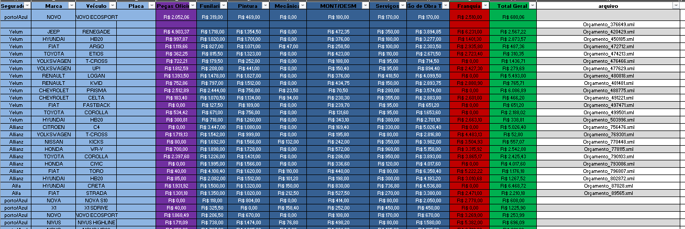
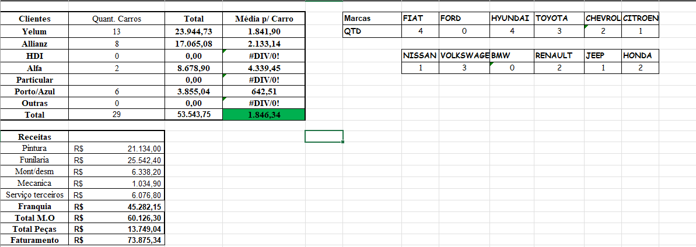
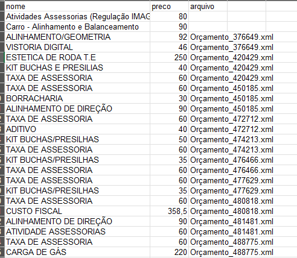

# Sistema de Geração de Planilhas de Orçamentos Automotivos

Este projeto automatiza a leitura de arquivos XML de orçamentos vindos do sistema de orçamentação Cilia e Porto/Azul seguros e gera planilhas Excel de controle financeiro

## Funcionalidades

- Extração de informações de veículos, seguradoras e valores.
- Geração de planilha com orçamentos consolidados.
- Controle de serviços terceirizados de forma separada.
- Atualização automática da planilha modelo com novos dados.

## Como usar

Clone o repositório:
   ```bash
   git clone https://github.com/Felgonsa/GeradorDePlanilhasOrcamento.git


2. Coloque os arquivos XML na pasta "orcamentos".
3. Execute "gerar_excel.exe".
4. O sistema criará a planilha automaticamente na pasta "planilhas".

Observações:
- Deixe o arquivo "planilha_modelo.xlsx" na raiz da pasta.
- Caso o antivírus bloqueie, clique em "Mais informações" > "Executar assim mesmo".

Planilhas:





